# Blending and Masking

Pixie supports variety of blending modes and some of them can be used for masking as well.

Starting with background image by Hulki Okan Tabak @hulkiokantabak of Bosphorus Coast, Istanbul, Turkey:

Here is what blends are capable of:

### NormalBlend

The default blend for everything. Just blends the colors normally.

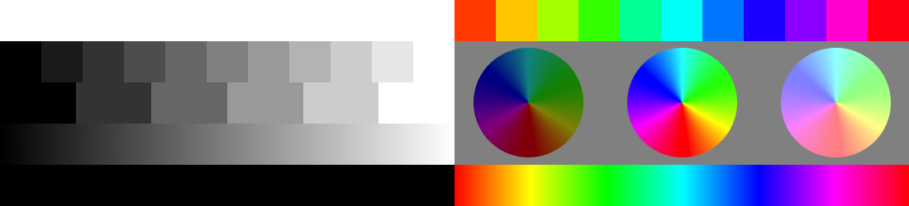

### DarkenBlend

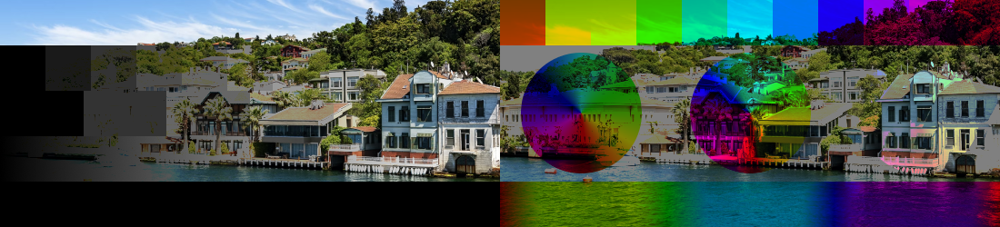

### MultiplyBlend

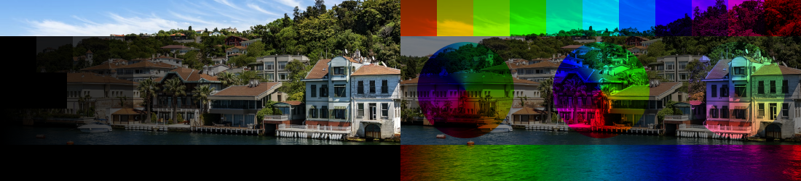

### ColorBurnBlend

### LightenBlend

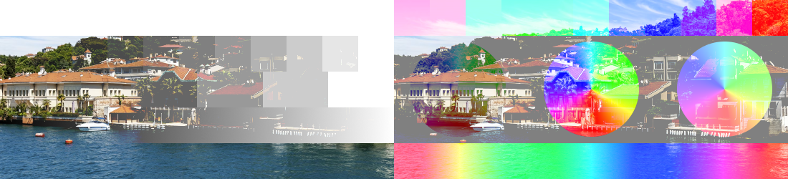

### ScreenBlend

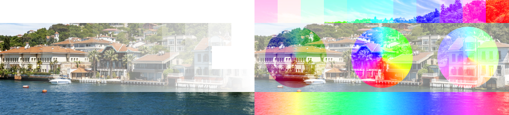

### ColorDodgeBlend

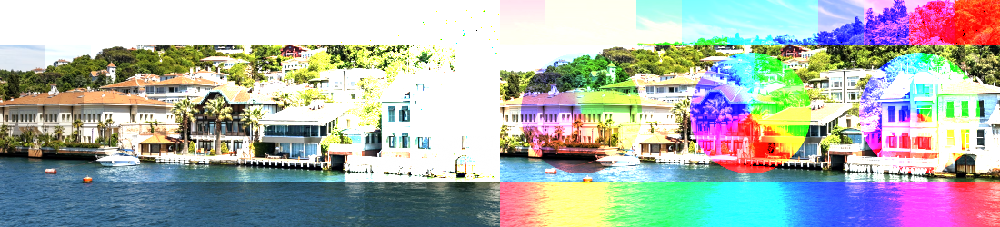

### OverlayBlend

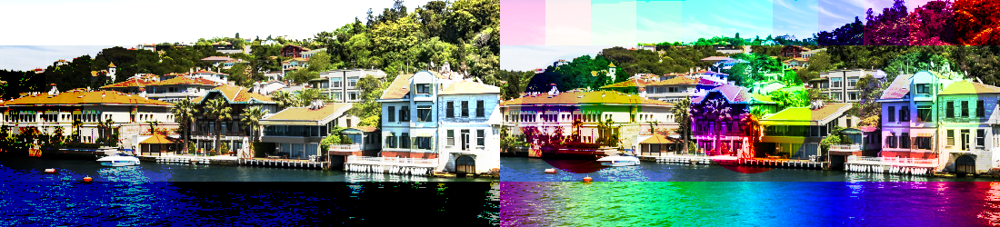

### SoftLightBlend

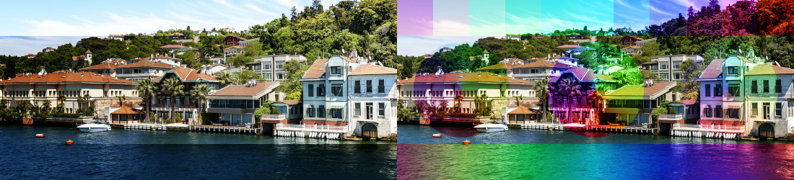

### HardLightBlend

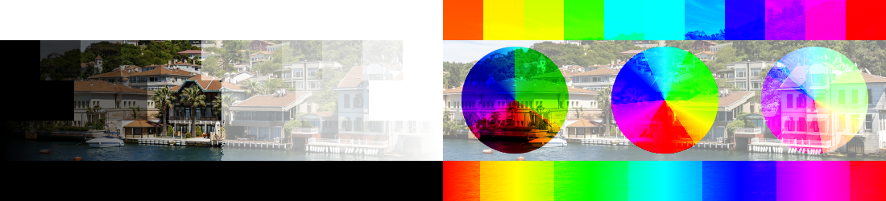

### DifferenceBlend

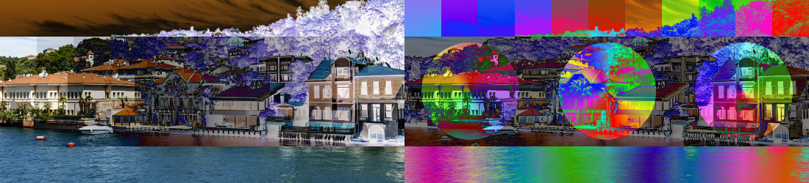

### ExclusionBlend

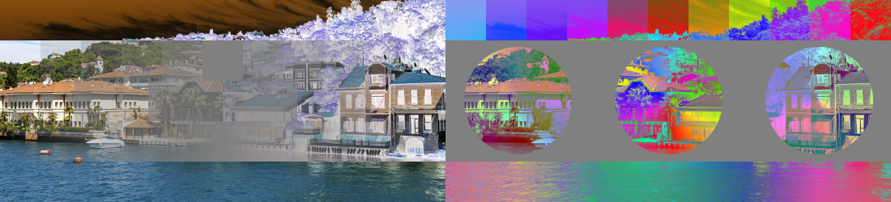

### HueBlend

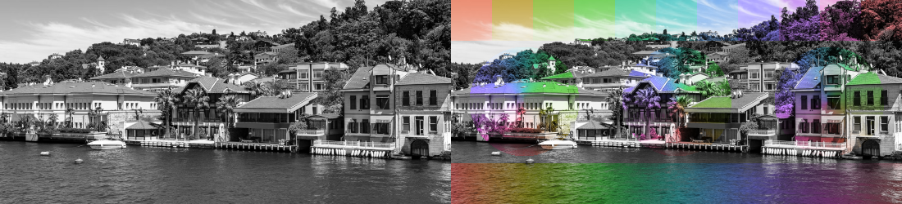

### SaturationBlend

### ColorBlend

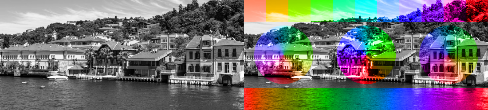

### LuminosityBlend

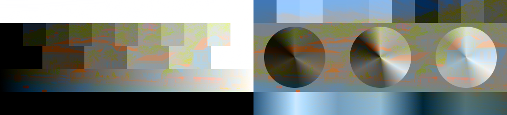

## Masking

Masking is just a special blend mode.

### MaskBlend

Default masking blend that is used to mask out or cut out areas.

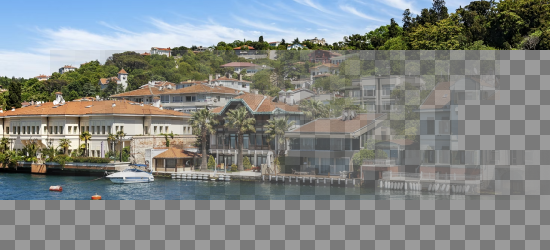

### SubtractMaskBlend

Subtract is just the opposite of mask blend.

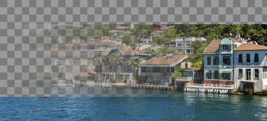

### ExcludeMaskBlend

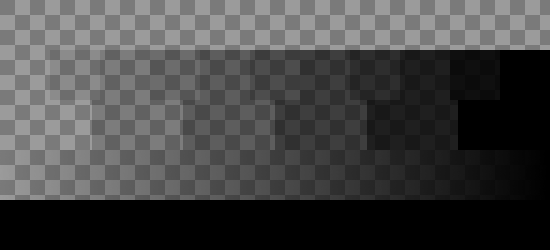

### OverwriteBlend

Overwrite blend is special in that it basically copies the data from one image into another without doing anything.

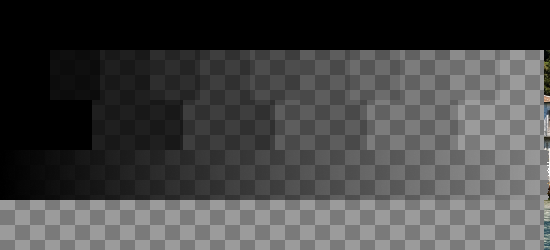
