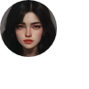

# Blending and Masking

Blending and masking are two techniques that are commonly used in digital graphics to create special effects or to manipulate the appearance of images.

Blending refers to the process of combining two or more images or layers in order to create a single, composite image. This can be done in a variety of ways, such as by overlaying one image on top of another, or by blending the colors of the two images together. Pixie supports a variety of blending modes, which are different algorithms that can be used to combine two images in different ways. Some common blending modes include "normal," "multiply," "screen," and "overlay."

Masking is a technique that is similar to blending, but it involves using an image or layer to selectively hide or reveal parts of another image or layer. This can be done by using the pixels in the masking image as an alpha channel, which defines the transparency of the image being masked. Pixie supports a variety of blending modes that can be used for masking, such as "mask" and "subtract" or "exclude."

Overall, blending and masking are powerful techniques that can be used to create a wide range of effects in digital graphics. They can be used to create composite images, add special effects to images, or to selectively hide or reveal parts of an image.

Starting with background image by Hulki Okan Tabak @hulkiokantabak of Bosphorus Coast, Istanbul, Turkey:


Here is what blends are capable of:

### NormalBlend

The default blend for everything. Just blends the colors normally.


### DarkenBlend


### MultiplyBlend


### ColorBurnBlend


### LightenBlend


### ScreenBlend


### ColorDodgeBlend


### OverlayBlend


### SoftLightBlend


### HardLightBlend


### DifferenceBlend


### ExclusionBlend


### HueBlend


### SaturationBlend


### ColorBlend


### LuminosityBlend


## Masking

Masking is just a special blend mode.

### Use MaskBlend to simulate a intersection of masks.

MaskBlend is the default blend for masking operations.


### Use NormalBlend to simulate a union of masks.


### Use SubtractMaskBlend to simulate a subtraction of masks.


### Use ExcludeMaskBlend to simulate a exclusion of masks.


<!-- ### MaskBlend

Default masking blend that is used to mask out or cut out areas.


### SubtractMaskBlend

Subtract is just the opposite of mask blend.


### ExcludeMaskBlend

 -->

## OverwriteBlend

`OverwriteBlend` is special in that it copies the data from one image into another as fast as possible.

This blend is only safe to use on to an image you know is empty. Usually an image that was just created.
Otherwise odd artifacts might or might not will happen based on optimization modes.

You can replace `NormalBlend` with `OverwriteBlend` if you know that the image you are drawing to is empty to speed up the process.
Its very common to draw things into just created empty images.

In this example, using `OverwriteBlend` here is faster as we know that `background` image was just created and is blank:

```nim
import pixie
let
  background = newImage(100, 100)
  profile = readImage("images/circleProfile.png")
background.draw(profile, blendMode = OverwriteBlend)
background.writeFile("images/overwriteBlend.png")
```


