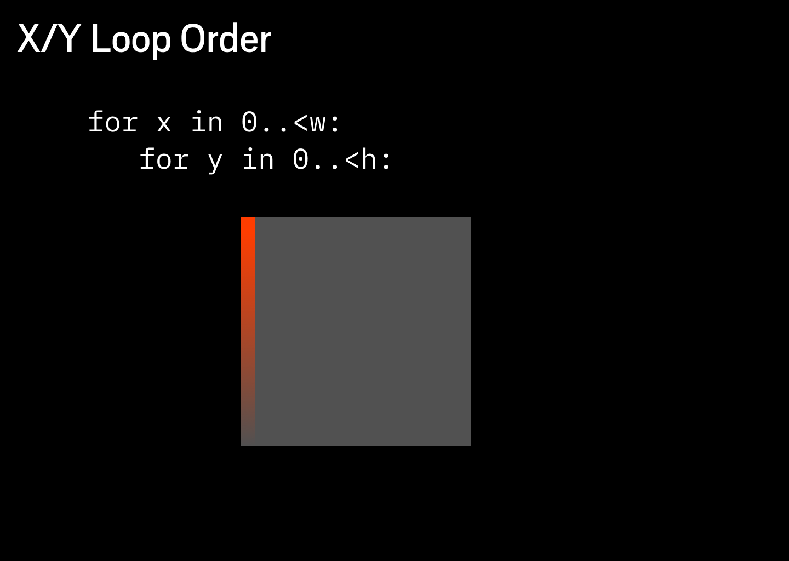
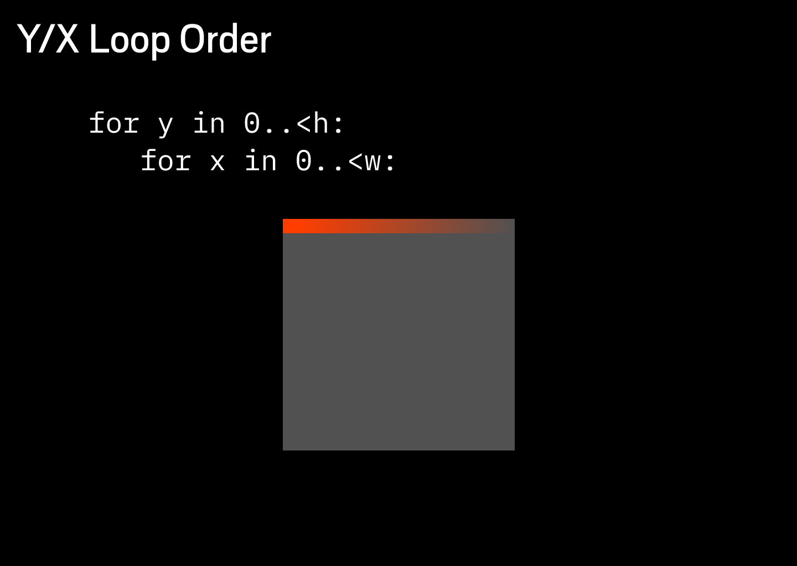

# Images

Pixie is all about pixels. Images can be thought of as two-dimensional arrays of pixels, with each pixel representing a specific color.


Each color is stored as RGBA bytes. First byte is red 0-255, followed by green 0-255, followed by blue 0-255, and finally followed by alpha 0-255.


## Color types

There are several color types in Pixie for different use cases:

* `Color` type means `float32` typed `Straight Alpha` where each value is 0.0 to 1.0.
* `ColorRGBA` types means `uint8` typed `Straight Alpha`.
* `ColorRGBX` type means `uint8` typed `Premultiplied Alpha` were each value is 0-255 and no value can be higher then alpha value.

All images and most operations in pixie are done in the `ColorRGBX` type.

## Premultiplied Alpha

Pixie stores all pixels in `Premultiplied Alpha` format as apposed to `Straight Alpha`.


Premultiplied Alpha can be complex to understand.
I did not get it at first.
But as we started to optimize things it became essential for high performance.
You probably need to understand `Premultiplied Alpha` just a little bit to reap its benefits.

`Straight Alpha` is probably what you are used to.
Each Color pixel has a value from 0.0 - 1.0 (or 0 to 255 when dealing with bytes).

But this is not the case with Premultiplied Alpha each color can never be larger then the alpha color. So if alpha is at 0.5 no color channel value can be larger then 0.5.

In effect each color is 0.0 - 1.0 is stored already multiplied by alpha.
Thats were the name comes from.


The magic of performance comes from blending colors together.
When we blend two `Straight Alpha` colors together we almost need to convert them to `Premultiplied Alpha` variant add them and then write them back.
Imagine doing this for every pixel it get quite slow.

But the good news is that you only need to be vaguely aware of this.
Pixie loads everything into `Premultiplied Alpha` when reading files and it writes everything back to `Straight Alpha` when saving them.


The `Premultiplied Alpha` and `Straight Alpha` is mostly just contained internally as optimization.
You only really need to worry about this when you are using Pixie together with some other library like OpenGL.

But even in OpenGL I recommend keeping your operation in `Premultiplied Alpha` state.

## Accessing pixels

You can read and writes pixels by using `image[x, y]`. It is very common to go through all the pixels using a x/y for loop.



We recommend going with Y in the outer loop and X in the inner loop because that accesses the pixels the way they are layed out in memory and is much faster then doing the X first, which causes slowdowns by access the memory out of order.



This can achieve **3x** speed up in many cases.

If you know that you are never accessing image out of bounds you could remove the out-of-bounds checks to speed up your code by using `image.unsafe[x, y]` instead.

```nim
for y in 0 ..< image.height:
  for x in 0 ..< image.width:
    var rgbx = image.unsafe[x, y]
    var color = rgbx.color()
    image.unsafe[x, y] = color.rgbx()
```

Keep in mind that pixie uses premultiplied alpha colors internally and you might need to convert it to a `ColorRgba` - a `uint8` color or a `Color` that uses `float32` instead.


## Image Formats

`PNG` (Portable Network Graphics) is a lossless image format that was designed to replace the `GIF` format and improve upon it. `PNG` supports both grayscale and full-color images, as well as alpha transparency, which allows pixels to be partially transparent. PNG was created in the mid-1990s as an open standard. It is a popular choice for web graphics because it supports lossless compression, which means that it can be compressed without losing any image quality.

`JPEG` (Joint Photographic Experts Group) is a lossy image format that was designed for digital photography. `JPEG` uses a complex algorithm to compress images, resulting in smaller file sizes compared to lossless formats like PNG. However, this compression comes at the cost of some image quality, as some of the image data is lost during the compression process. `JPEG` is a popular choice for photographs because it can produce small file sizes while still maintaining a high level of visual quality.

`GIF` (Graphics Interchange Format) is an image format that was developed in the late 1980s. `GIF` supports up to 8 bits per pixel, which allows it to display 256 distinct colors (without hacks). `GIF` is best known for its support for animation, as it allows multiple images to be combined into a single file and displayed in sequence. `GIF` is a lossless format, which means that it can be compressed without losing any image quality. However, due to the limited color depth and the lossless nature of the format, `GIF` files are usually much larger than other image formats like `PNG` or `JPEG`.

`BMP` (Bitmap Image File) is a simple image format that was developed by Microsoft. `BMP` files store image data in a raster graphics format, meaning that they are made up of a grid of pixels, each with a specific color. `BMP` is a uncompressed format, which means that it can be used without losing any image quality. However, `BMP` files can be quite large due to the lack of advanced compression techniques used by other formats. `BMP` is not as widely used as other image formats, but it is still supported for historical reasons because is used by many win32 APIs and older windows applications.

`PPM` (Portable Pixmap) is a simple image file format used for storing bitmap images. It was developed in the early 1980s as a cross-platform alternative to the `GIF` format, which at the time was patented and required a license to use. It is mostly used for compatibility on Linux and X11.

`QOI` (Quite OK Image) format is a new, efficient, and fast lossless image format with a simple encoder and decoder. Its specification can be found on a single page, making it easy to understand and implement. Despite its simplicity, `QOI` is able to achieve compression levels similar to those of `PNG`. The main drawback of `QOI` is its rarity, which may make it difficult to find and use as there are virtual no tools or applications that support it.

In general, `PNG` is a good choice for images that need to be high quality and support transparency, such as graphics for the web. `JPEG` is a good choice for photographs and other images with many colors, as it can produce small file sizes while still maintaining a good level of quality. `GIF` is best for simple graphics and animations, while `BMP` and `PPM` is only required for compatibility.
