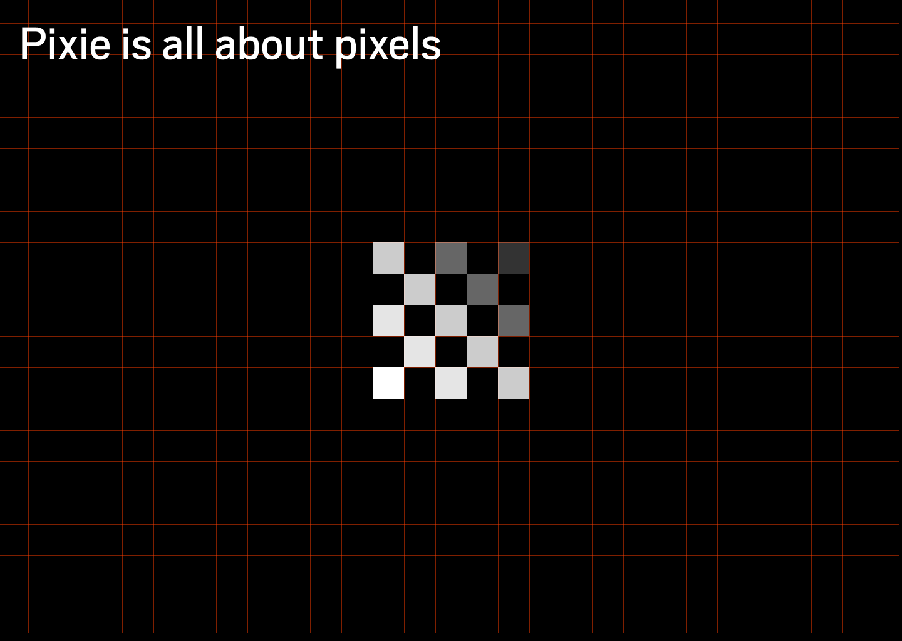
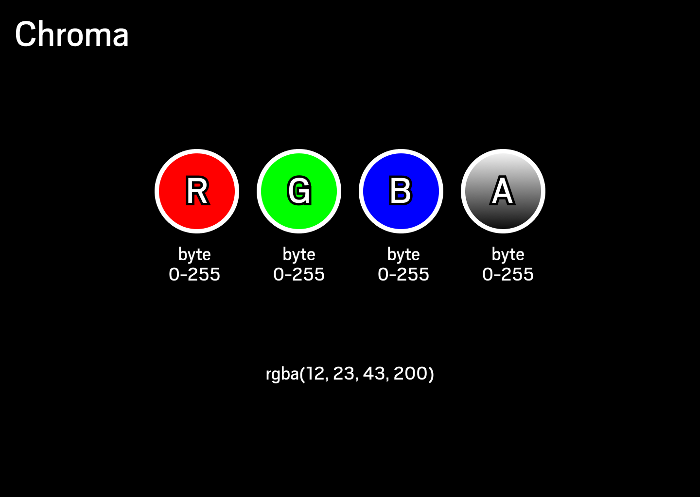
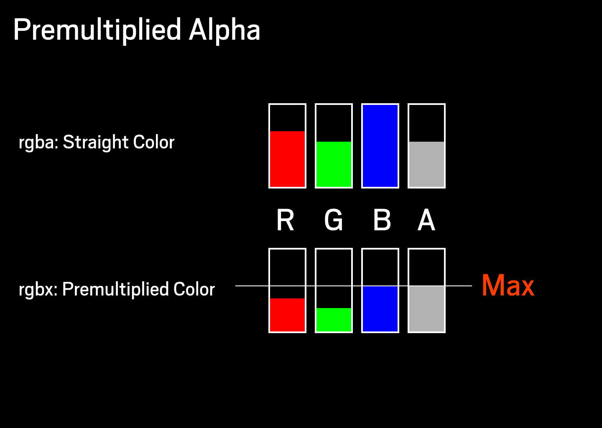
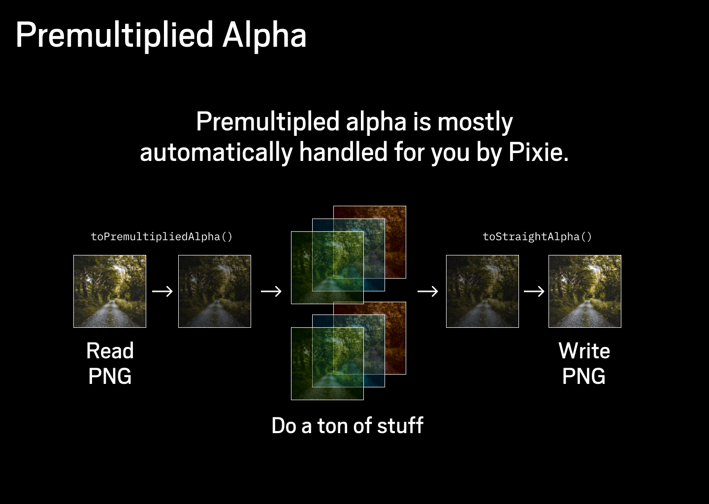

# Images

Pixie is all about pixels. And pixels are stored in images. Pixels are little square of color. And images are a grid of pixels with a known width and height.

Each color is stored as RGBA bytes. First bight is red 0-255, followed by green 0-255, followed by blue 0-255, and finally followed by alpha 0-255.

## Color types

There are several color types in Pixie for different use cases:

* `Color` type means `float32` typed `Straight Alpha` where each value is 0.0 to 1.0.
* `ColorRGBA` types means `uint8` typed `Straight Alpha`.
* `ColorRGBX` type means `uint8` typed `Premultiplied Alpha` were each value is 0-255 and no value can be higher then alpha value.

All images and most operations in pixie are done in the `ColorRGBX` type.

## Premultiplied Alpha

Pixie stores all pixels in `Premultiplied Alpha` format as apposed to `Straight Alpha`.

Premultiplied Alpha can be complex to understand.
I did not get it at first.
But as we started to optimize things it became essential for high performance.
You probably need to understand `Premultiplied Alpha` just a little bit to reap its benefits.

`Straight Alpha` is probably what you are used to.
Each Color pixel has a value from 0.0 - 1.0 (or 0 to 255 when dealing with bytes).

But this is not the case with Premultiplied Alpha each color can never be larger then the alpha color. So if alpha is at 0.5 no color channel value can be larger then 0.5.

In effect each color is 0.0 - 1.0 is stored already multiplied by alpha.
Thats were the name comes from.

The magic of performance comes from blending colors together.
When we blend two `Straight Alpha` colors together we almost need to convert them to `Premultiplied Alpha` variant add them and then write them back.
Imagine doing this for every pixel it get quite slow.

But the good news is that you only need to be vaguely aware of this.
Pixie loads everything into `Premultiplied Alpha` when reading files and it writes everything back to `Straight Alpha` when saving them.

The `Premultiplied Alpha` and `Straight Alpha` is mostly just contained internally as optimization.
You only really need to worry about this when you are using Pixie together with some other library like OpenGL.

But even in OpenGL I recommend keeping your operation in `Premultiplied Alpha` state.
