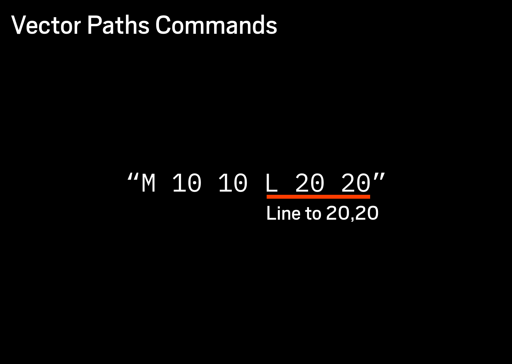
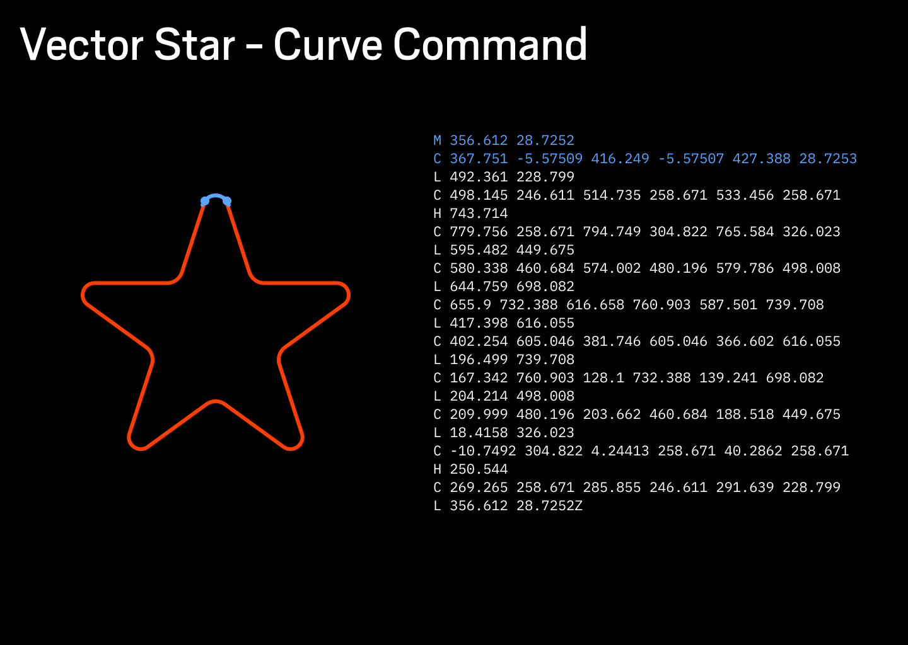
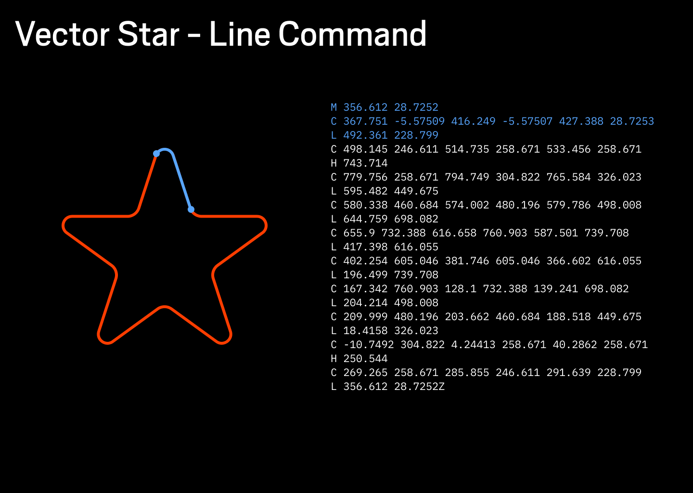
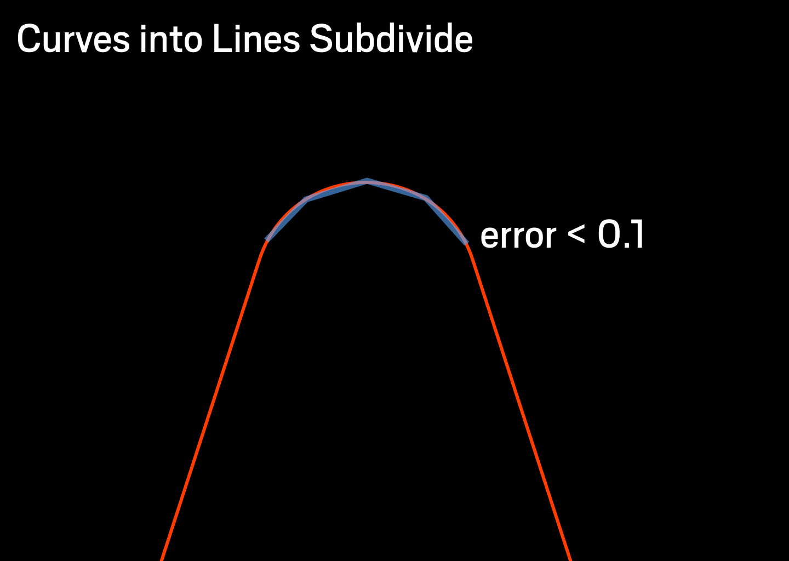
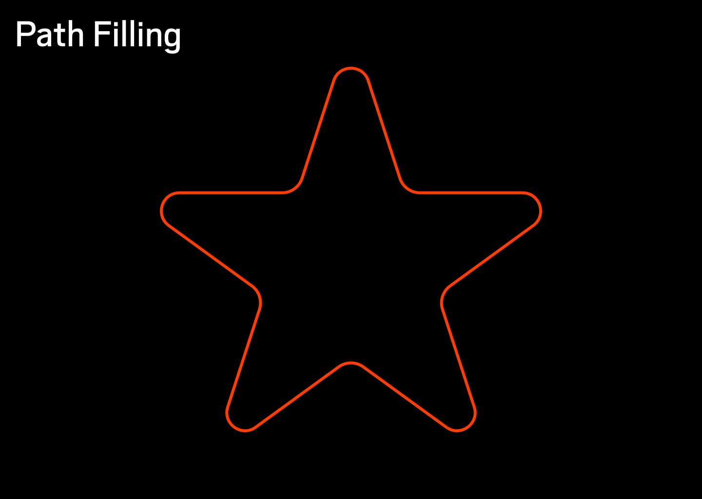
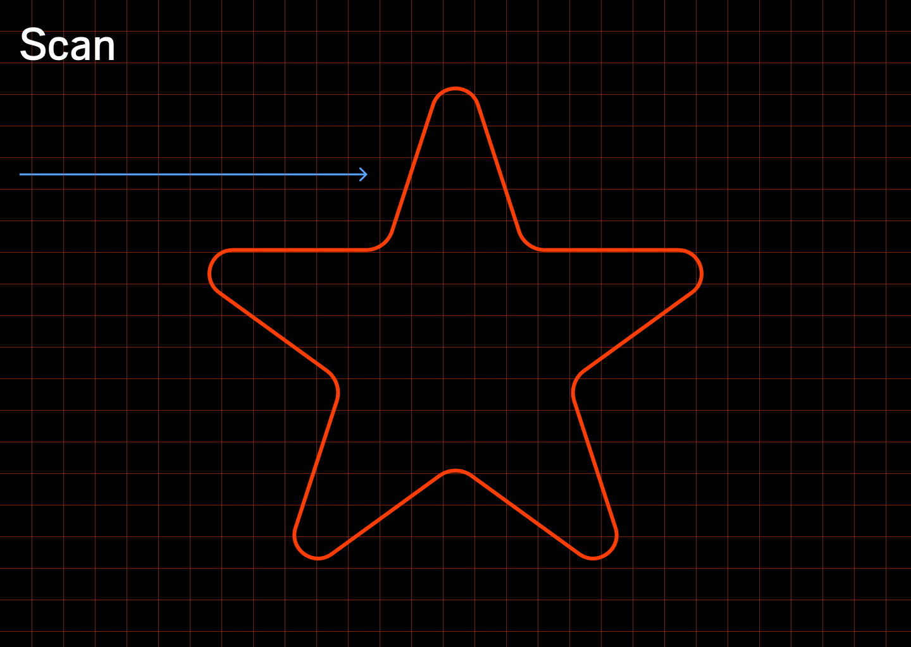
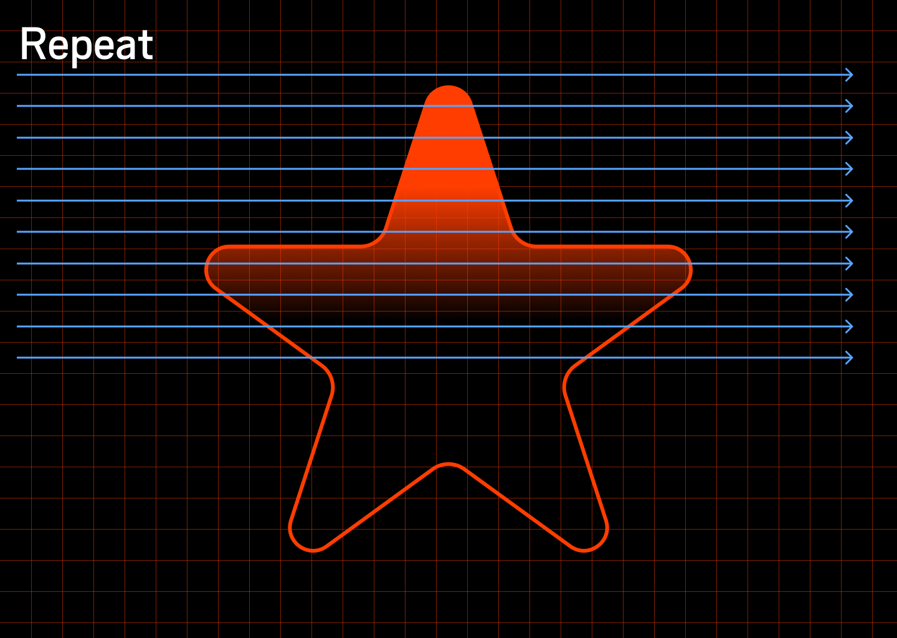
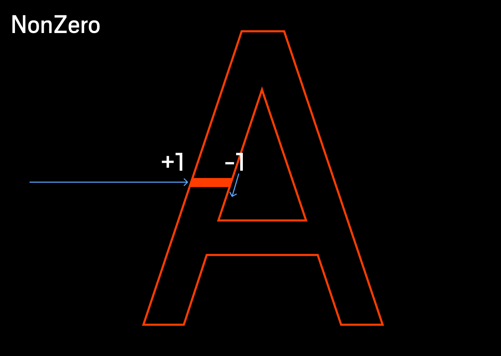
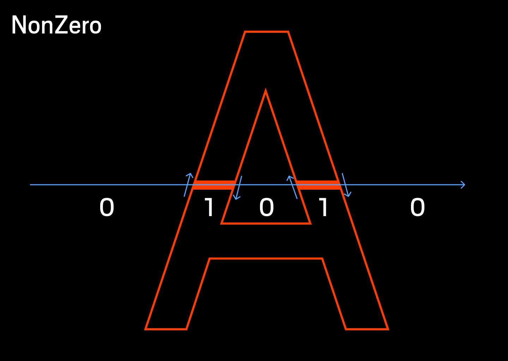
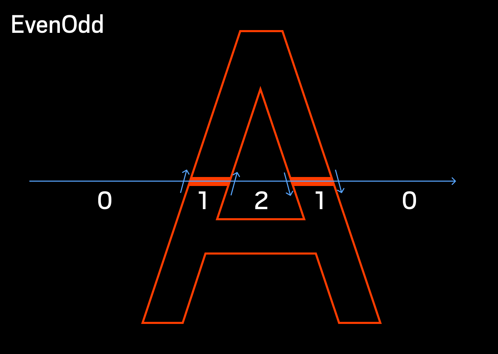

# Paths

At the core of vector graphics there is rasterization.

> [Rasterisation](https://en.wikipedia.org/wiki/Rasterisation) (or rasterization) is the task of taking an image described in a **vector graphics format** (shapes) and converting it into a **raster image** (a series of pixels).

What it does is takes outlines described by liens and curves and fills the grid with appropriate filled and not filled cells.

A common format to describe vector path is the SVG Path command string.

First "M" part means move is a move the path pen without drawing anything.

The second is the "L" line command tell the path pen to draw a line.

A more complex shape like this start can be described by but the SVG path above. It contains "M" move, "C" curves and "L" lines and "H" horizontal lines.

First command of this start is a move command.

Then comes the "C" curve command. It describes a bezier curve.

Then comes the "L" line command.

When we fill paths we actually just want lines. So we subdivide the curves into lines.

We keep subdividing the line segments path until the error of a segment is small enough.

This varies based on what is the scale of the path. A large path can subdivide into many many line segments while a little curve smaller then a pixel can be a just a single segment.

Finally we have an outline of an images all made out of line segments. We can start filling the path.

To rasterize we perform a ray scan for each row of pixels. Here we chose to scan from left to right, top to bottom, but really you can scan in any direction as long as your consistent

When our scan ray hits a line, we start filling that row.

Once we hit another line we stop.

We do that for every row until we have a complete image.

To have the images be smooth we can Anti-Alias. To produce smooth shapes we can cast a ray multiple times per pixel.

One other important thing to know is the winding rules. When a scan ray hits a edge we need to record if the edge is going up or down. This is called winding order.

If the ray is going up we +1 to winding count.

If the its going down we -1.

This way we can scan the whole image. And have complex interactive shapes.

There are tow rules the non-zero rule and the even-odd rule. With non-zero you always fill if the winding count != 0.

With even-odd you fill if winding count is an odd number.

Paths are usually defined is non-zero or even-odd. Only the simplest paths look the same with both rules, the more complex paths with holes will use one or the other rules.

Here is an example of the same path that was meant to be drawn with non-zero but looks incorrect when drawn with even-odd.

Non-zero is primary used for text and I feel is more common.
