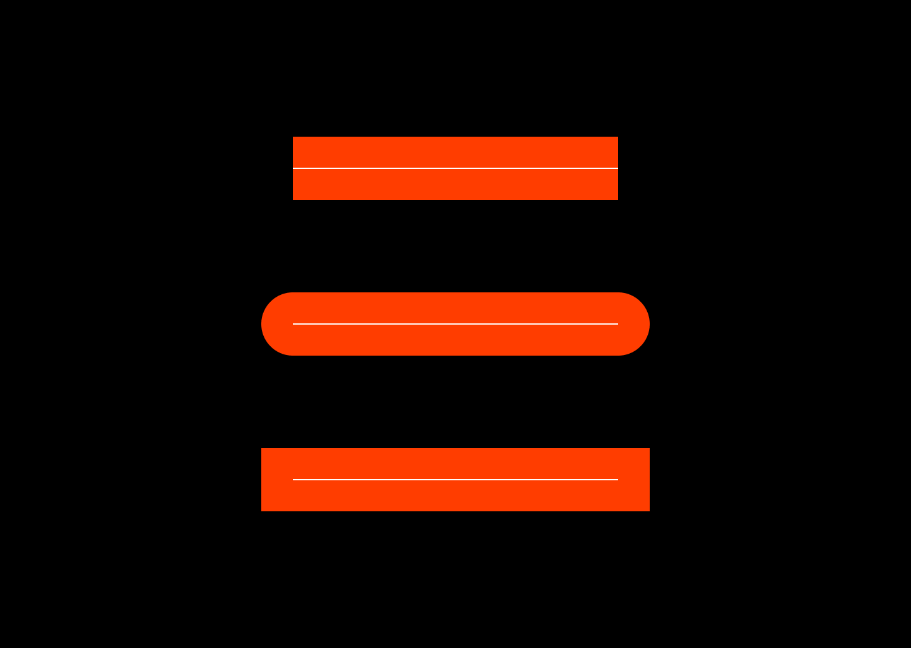
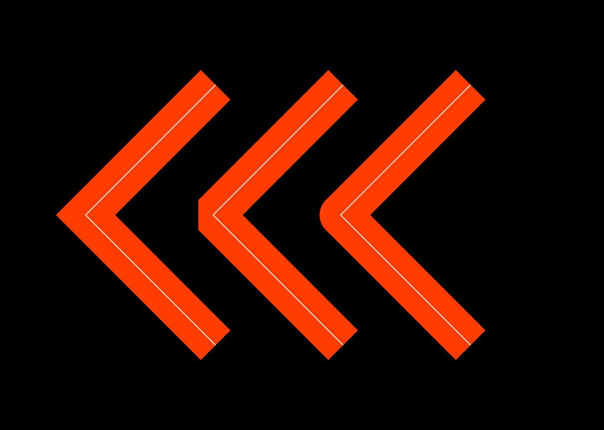

# Paths

In computer graphics, a path is a series of connected strokes that can be used to create a shape or outline. Paths can be open, meaning that they do not form a closed shape, or closed, meaning that they form a closed shape. Vector graphics are graphics that are created using mathematical equations to draw lines and curves. These graphics are made up of paths, and they can be scaled to any size without losing quality because they are not made up of pixels like bitmap graphics.

Vector graphics are often used for logos, icons, text and other graphics that need to be resized or modified frequently because they can be easily edited and scaled without losing quality. They are also useful for creating graphics that need to be printed at a high resolution because they can be rendered smoothly at any size.

A common format to describe vector path is the SVG Path command string.

Lets take this format apart.

First "M" part means move is a move the path pen without drawing anything.

The second is the "L" line command tell the path pen to draw a line.

Lets look at more complex vector shape:

A shape like this start can be described by but the SVG path above. It contains "M" move, "C" curves and "L" lines and "H" horizontal lines.

First command of this start is a move command.

Then comes the "C" curve command. It describes a bezier curve.

Then comes the "L" line command. This then repeat for all of the commands.

Pixie can `parsePath("")` SVG path specification or you can build by calling more advanced methods on the Path objects itself.

SVG Command   | Path Command       | Description
------------- | ------------------ | -----------------------------------
M m           | .moveTo            | move to
L l           | .lineTo            | line to
H h           | .lineTo            | horizontal line to
V v           | .lineTo            | vertical line to
C c S s       | .bezierCurveTo     | cubic curve to
Q q T t       | .quadraticCurveTo  | quadratic curve to
A a           | .ellipticalArcTo   | arc to
z             | .closePath         | close path
&nbsp;        | .polygon           | N sided polygon
&nbsp;        | .circle            | circle
&nbsp;        | .ellipse           | ellipse
&nbsp;        | .rect              | rectangle
&nbsp;        | .roundedRect       | rounded rectangle
&nbsp;        | .arc               | circular arc
&nbsp;        | .arcTo             | circular arc using control points
&nbsp;        | .addPath           | add another path to this path

## Rasterization

At the core of vector graphics there is rasterization.

> [Rasterisation](https://en.wikipedia.org/wiki/Rasterisation) (or rasterization) is the task of taking an image described in a **vector graphics format** (shapes) and converting it into a **raster image** (a series of pixels).

## Discretizeing

When we fill paths we actually just want lines. So we subdivide the curves into lines.

We keep subdividing the line segments path until the error of a segment is small enough.

This varies based on what is the scale of the path. A large path can subdivide into many many line segments while a little curve smaller then a pixel can be a just a single segment.

## Path Filling

Finally we have an outline of an images all made out of line segments. We can start filling the path.

To rasterize we perform a ray scan for each row of pixels. Here we chose to scan from left to right, top to bottom, but really you can scan in any direction as long as your consistent

When our scan ray hits a line, we start filling that row.

Once we hit another line we stop.

We do that for every row until we have a complete image.

To have the images be smooth we can Anti-Alias. To produce smooth shapes we can cast a ray multiple times per pixel.

## Winding Rules

SVG uses a set of winding rules to determine how the fill of a shape is calculated. These rules specify how the direction of the paths of a shape are interpreted in relation to the fill of the shape.

There are two main winding rules: the `non-zero` winding rule and the `even-odd` winding rule.

The `non-zero` winding rule states that a point is inside the shape if the number of clockwise path segments around the point is not equal to the number of counter-clockwise path segments. In other words, the total winding number around the point must not be zero.

The `even-odd` winding rule states that a point is inside the shape if the number of path segments around the point is odd.

Both winding rules can be used to fill a shape, and the one that is used can be specified in the SVG code. The default winding rule for SVG is the `non-zero` winding rule so it comes up more often.

When a scan ray hits a edge we need to record if the edge is going up or down. This is called winding order.

If the ray is going up we +1 to winding count.

If the its going down we -1.

This way we can scan the whole image. And have complex interactive shapes.

With `even-odd` you fill if winding count is an odd number.

Paths must be defined is `non-zero` or `even-odd`. Only the simplest paths look the same with both rules, the more complex paths with holes will use one or the other rules.

Here is an example of the same path that was meant to be drawn with `non-zero` but looks incorrect when drawn with `even-odd`.

`Non-zero` is primary used for text.

## Caps and Joins

In digital graphics, caps and joins are terms that refer to the way that strokes (lines and curves) are drawn and connected to each other. Caps refer to the way that the ends of a stroke are drawn, and joins refer to the way that two strokes are connected when they meet.

Caps and joins are important because they can affect the appearance and readability of a graphic. For example, if the caps of a line are too small or too large, it can make the line difficult to see or follow. Similarly, if the joins between strokes are not smooth or well-defined, it can make a graphic look jagged or disjointed.

Pixie supports three different types of caps: `ButtCap`, `RoundCap`, and `SquareCap`. The butt cap is a flat cap that extends the stroke to the end point without adding any additional shape. The round cap is a circular cap that extends the stroke by adding a half-circle at the end point. The square cap is a rectangular cap that extends the stroke by adding a square at the end point.

Pixie also supports three different types of joins: `MiterJoin`, `RoundJoin`, and `BevelJoin`. The miter join is a sharp, pointed join that is created by extending the strokes at their intersection point until they meet.
The round join is a smooth, curved join that is created by connecting the endpoints of the strokes with a circular arc.
The bevel join is a flat join that is created by connecting the endpoints of the strokes with a straight line. T

The miter angle limit is used to control the maximum angle that the strokes can be extended before the miter join is replaced with aa bevel join. This can be useful because very large miter angles can create long, pointed joins that may not look aesthetically pleasing or may be difficult to read.

Overall, caps and joins are important features of digital graphics that can affect the appearance and readability of a graphic. By choosing the appropriate caps and joins for a given graphic, you can create smooth, well-defined lines and curves that are easy to read and follow.
