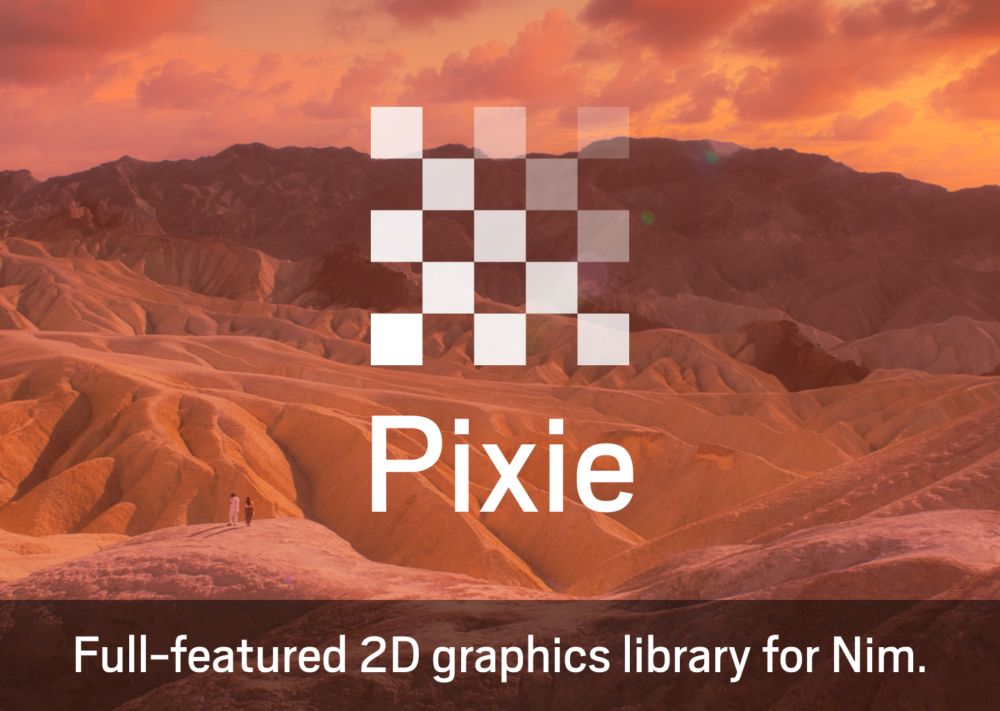

# Pixie

Pixie is a 2D graphics library similar to [Cairo](https://www.cairographics.org/) and [Skia](https://skia.org) written (almost) entirely in Nim.

Check out its github repo:
https://github.com/treeform/pixie

## Table of contents

* [Chapter 1: Paths](paths.md)
* [Chapter 2: Text](text.md)
* [Chapter 2: Performance](perf.md)
