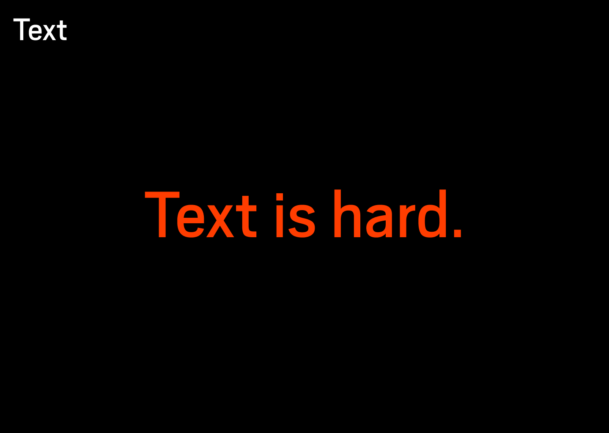
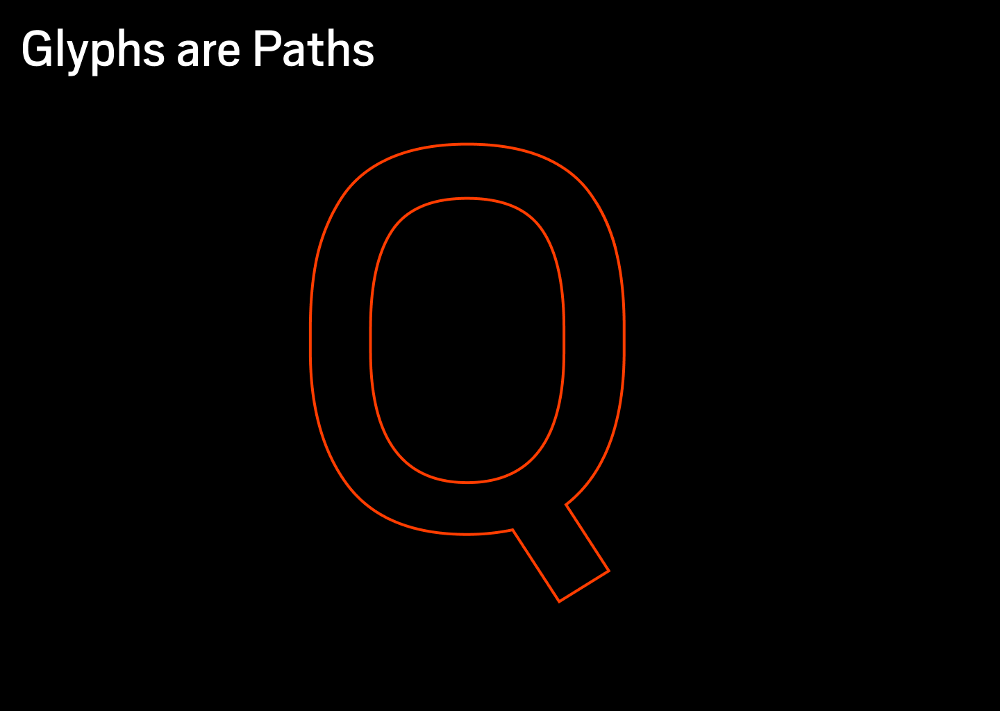
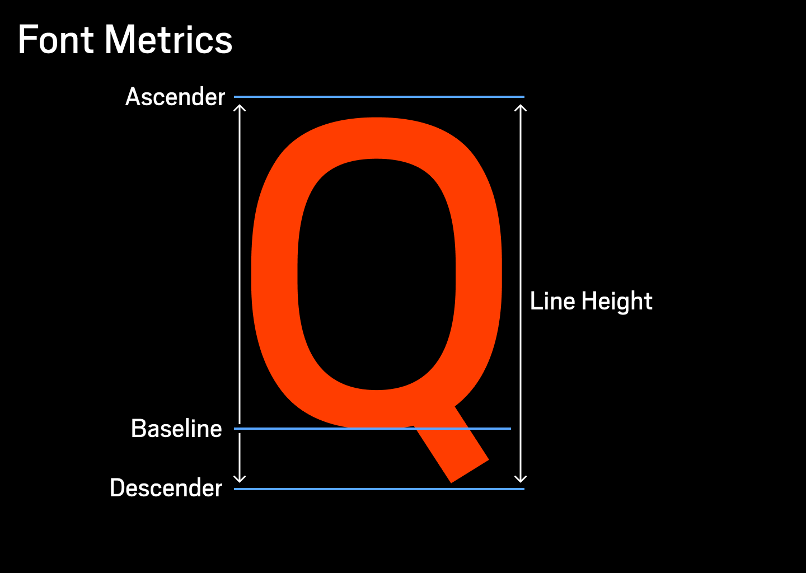
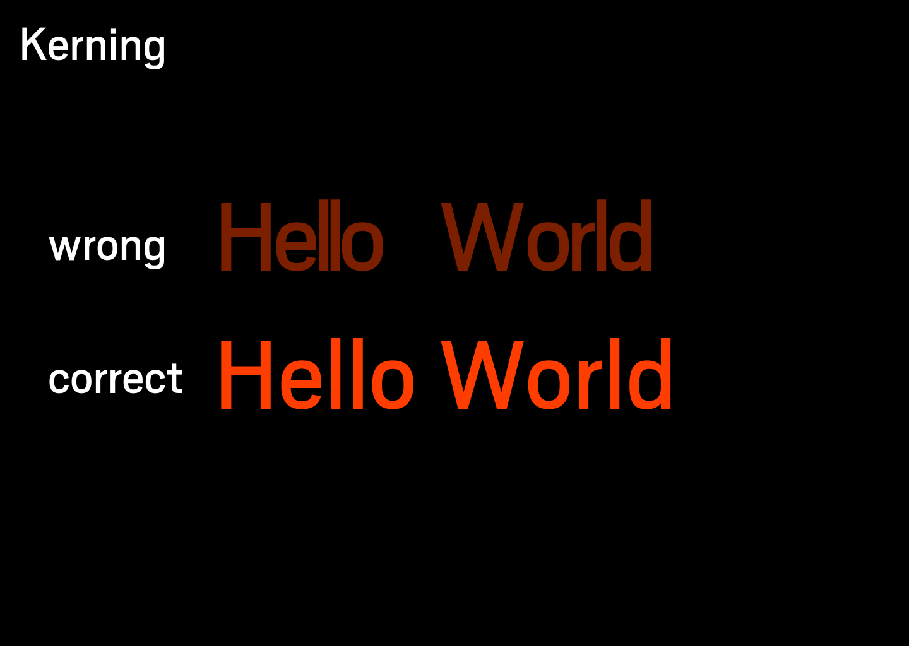
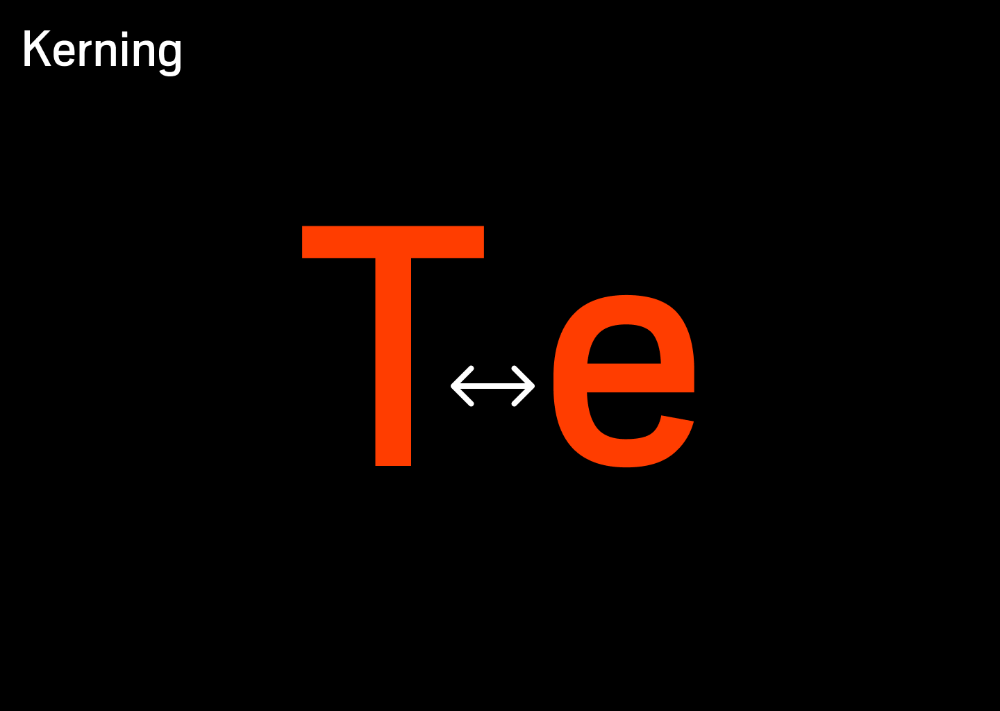
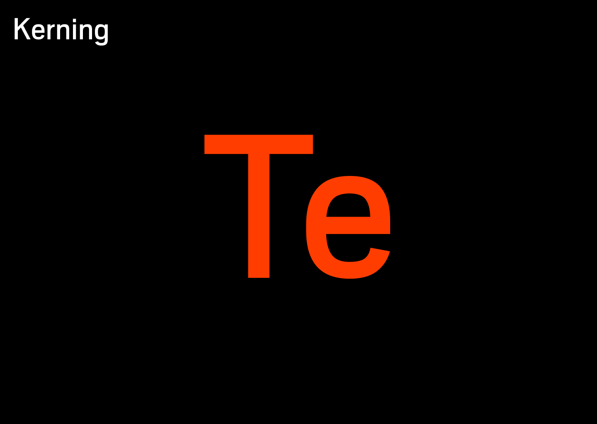
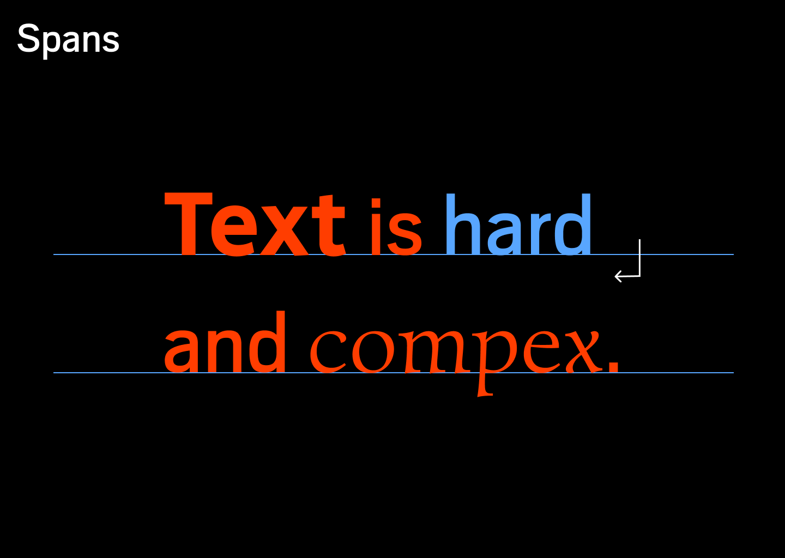

# Text

Pixie can draw text. It aims to be a replacement for freetype/harfbuzz/pango libraries. It aims to be a unified system for drawing text.

Text is pretty hard to draw with a lot of gotchas. There are just so many languages and writing modes out there.

But at its basic level text is just a collection of glyphs (letters) and glyphs are just paths.

Each glyph has a set of metrics that you can query from the typeface.
The metrics explain how a glyphs should fit with the other glyphs.

Its very important to get kerning correct.
You can see how obviously bad incorrect kerning looks like:

The kerning refers to distance or more properly the adjustment of the default distance between the letters.
Kerning can be negative or positive.

Its important to get text to be kerned correctly.

In pixie Span refers to a span of text with same font, size and paint color.
With pixie you can layout any number of spans following each other.
I would recommend always ending a span on a space or a newline because there is no kerning between letters of different fonts and sizes.

